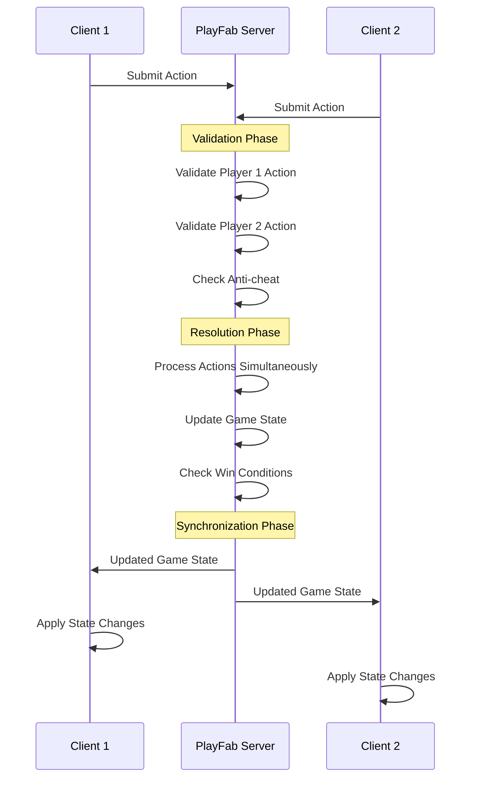

# Dokkaebi Multiplayer Architecture

## Table of Contents
1. [Architecture Overview](#architecture-overview)
2. [System Components](#system-components)
3. [Turn Flow & State Management](#turn-flow--state-management)
4. [Server-Side Validation](#server-side-validation)
5. [Anti-Cheat System](#anti-cheat-system)
6. [Network Communication](#network-communication)
7. [Implementation Details](#implementation-details)
8. [Security Considerations](#security-considerations)

---

## Architecture Overview

Dokkaebi implements a **multiplayer-first** architecture using PlayFab's authoritative server system. All game logic validation occurs server-side, ensuring fair play and preventing cheating.

### Key Principles
- **Server Authority:** All game state changes validated server-side
- **Client Prediction:** Minimal client-side prediction for responsiveness
- **State Synchronization:** Authoritative state continuously synchronized
- **Anti-cheat First:** Security built into every system component

### Architecture Diagram
```
┌─────────────────┐    ┌──────────────────────┐    ┌─────────────────┐
│   Client 1      │    │   PlayFab Cloud      │    │   Client 2      │
│                 │    │                      │    │                 │
│ ┌─────────────┐ │    │ ┌──────────────────┐ │    │ ┌─────────────┐ │
│ │ Game State  │◄├────┤►│ Authoritative    │◄├────┤►│ Game State  │ │
│ │ Manager     │ │    │ │ Game State       │ │    │ │ Manager     │ │
│ └─────────────┘ │    │ └──────────────────┘ │    │ └─────────────┘ │
│                 │    │                      │    │                 │
│ ┌─────────────┐ │    │ ┌──────────────────┐ │    │ ┌─────────────┐ │
│ │ V3 Turn     │ │    │ │ Validation       │ │    │ │ V3 Turn     │ │
│ │ Manager     │ │    │ │ Module           │ │    │ │ Manager     │ │
│ └─────────────┘ │    │ └──────────────────┘ │    │ └─────────────┘ │
│                 │    │                      │    │                 │
│ ┌─────────────┐ │    │ ┌──────────────────┐ │    │ ┌─────────────┐ │
│ │ Player      │ │    │ │ CloudScript      │ │    │ │ Player      │ │
│ │ Actions     │ │    │ │ Functions        │ │    │ │ Actions     │ │
│ └─────────────┘ │    │ └──────────────────┘ │    │ └─────────────┘ │
└─────────────────┘    └──────────────────────┘    └─────────────────┘
```

---

## System Components

### 1. Client-Side Components

#### **V3TurnManagerMultiplayer**
```csharp
Location: Assets/Scripts/TurnSystem/V3TurnManagerMultiplayer.cs
Purpose: Network-aware turn system management
Key Features:
- Action submission to PlayFab
- Turn state synchronization
- Player ready status tracking
- Connection state monitoring
```

#### **GameStateManagerMultiplayer**
```csharp
Location: Assets/Scripts/Core/Networking/GameStateManagerMultiplayer.cs
Purpose: Authoritative state synchronization
Key Features:
- Server state application to local objects
- Unit position/health/aura synchronization
- Zone state updates
- Conflict resolution
```

#### **NetworkingManager**
```csharp
Location: Assets/Scripts/Core/Networking/NetworkingManager.cs
Purpose: PlayFab communication layer
Key Features:
- CloudScript function calls
- Authentication management
- Error handling and retry logic
- Connection state management
```

### 2. Server-Side Components (PlayFab CloudScript)

#### **SubmitPlayerAction.js**
```javascript
Location: Assets/Scripts/Core/Networking/CloudScripts/SubmitPlayerAction.js
Purpose: Main action processing endpoint
Responsibilities:
- Player authentication
- Input validation
- Action processing
- Turn resolution
- Game end detection
```

#### **ValidationModule.js**
```javascript
Location: Assets/Scripts/Core/Networking/CloudScripts/ValidationModule.js
Purpose: Comprehensive validation system
Features:
- Movement validation
- Ability targeting validation
- Resource cost validation
- Anti-cheat detection
- Security violation logging
```

#### **GetGameState.js**
```javascript
Location: Assets/Scripts/Core/Networking/CloudScripts/GetGameState.js
Purpose: State retrieval endpoint
Features:
- Secure state access
- Player authorization
- State formatting
- Privacy controls
```

---

## Turn Flow & State Management

### Turn Processing Pipeline



### State Synchronization Process

1. **Client Action Submission**
   - Player submits action through `V3TurnManagerMultiplayer`
   - Action serialized using `PlayerAction.Serialize()`
   - Sent to PlayFab via `NetworkingManager`

2. **Server Validation**
   - `ValidationModule` validates all aspects of action
   - Anti-cheat checks performed
   - Action either accepted or rejected

3. **Turn Resolution**
   - When both players submit, server resolves turn
   - Actions processed simultaneously for fairness
   - Game state updated authoritatively

4. **State Distribution**
   - Updated state sent to all clients
   - `GameStateManagerMultiplayer` applies changes
   - Visual updates triggered

### Game State Structure

```json
{
  "matchId": "unique-match-identifier",
  "gameStatus": "ACTIVE | COMPLETED | CANCELLED",
  "currentTurn": 1,
  "currentPhase": "ActionSubmission | Resolution",
  "turnStartTime": 1234567890,
  
  "player1": {
    "playerId": "player-1-id",
    "hasSubmitted": false,
    "submittedActions": [],
    "currentAura": 10,
    "maxAura": 15
  },
  
  "player2": {
    "playerId": "player-2-id", 
    "hasSubmitted": false,
    "submittedActions": [],
    "currentAura": 10,
    "maxAura": 15
  },
  
  "units": [
    {
      "unitId": 1,
      "owner": 1,
      "position": { "x": 2, "z": 3 },
      "currentHealth": 100,
      "maxHealth": 100,
      "currentAura": 5,
      "abilities": ["fireball", "heal"],
      "statusEffects": [],
      "hasActed": false
    }
  ],
  
  "zones": [
    {
      "id": "zone-1",
      "position": { "x": 5, "z": 5 },
      "type": "fire",
      "duration": 3,
      "owner": 1,
      "effects": { "damage": 10 }
    }
  ],
  
  "winner": null,
  "endReason": null,
  "lastUpdated": 1234567890
}
```

---

## Server-Side Validation

### Validation Layers

#### 1. **Input Validation**
```javascript
// Validates basic action structure and types
validateActionInput(action) {
  - Check required fields
  - Validate data types
  - Ensure action type is supported
  - Validate position bounds
}
```

#### 2. **Game State Validation**
```javascript
// Validates against current game state
validateTurnState(gameState, playerNumber) {
  - Check game is active
  - Verify correct phase
  - Ensure player hasn't already submitted
  - Check turn time limits
}
```

#### 3. **Action-Specific Validation**
```javascript
// Validates specific action legality
validateSpecificAction(gameState, action, playerNumber) {
  - Unit ownership verification
  - Unit status checking (alive, hasn't acted)
  - Movement range validation
  - Ability usage validation
  - Resource cost checking
}
```

#### 4. **Anti-Cheat Validation**
```javascript
// Detects cheating attempts
performAntiCheatValidation(gameState, action, playerId) {
  - Impossible action detection
  - Rapid submission protection
  - Duplicate action prevention  
  - Statistical anomaly detection
  - Player behavior analysis
}
```

### Validation Example: Movement Action

```javascript
function validateMoveAction(gameState, unit, targetPosition) {
    // 1. Bounds checking
    if (!isPositionInBounds(targetPosition)) {
        return { isValid: false, error: "Out of bounds" };
    }
    
    // 2. Range validation
    const distance = calculateDistance(unit.position, targetPosition);
    if (distance > MAX_MOVEMENT_RANGE) {
        return { isValid: false, error: "Range exceeded" };
    }
    
    // 3. Occupancy checking
    if (isPositionOccupied(gameState, targetPosition)) {
        return { isValid: false, error: "Position occupied" };
    }
    
    // 4. Pathfinding validation
    if (!hasValidMovementPath(gameState, unit.position, targetPosition)) {
        return { isValid: false, error: "Path blocked" };
    }
    
    return { isValid: true };
}
```

---

## Anti-Cheat System

### Detection Methods

#### 1. **Impossible Action Detection**
- Movement beyond maximum range
- Abilities targeting out of range
- Actions on destroyed units
- Using abilities not possessed

#### 2. **Timing Analysis**
- Rapid-fire action submissions
- Inhuman reaction times
- Perfect timing patterns
- Submission rate analysis

#### 3. **Statistical Analysis**
- Perfect accuracy rates
- Impossible win/loss ratios
- Consistent optimal plays
- Behavioral pattern analysis

#### 4. **Duplicate Action Prevention**
- Action fingerprinting
- Submission deduplication
- Replay attack prevention
- Session integrity checks

### Penalty System

```javascript
// Progressive penalty system
violationCount >= 10: Permanent Ban
violationCount >= 5:  24-hour Ban
violationCount >= 3:  1-hour Timeout
violationCount >= 1:  Warning logged
```

### Security Violation Logging

```json
{
  "playerId": "player-id",
  "timestamp": 1234567890,
  "violationType": "IMPOSSIBLE_ACTION",
  "severity": "HIGH",
  "action": "{serialized action data}",
  "gameState": "{relevant state data}",
  "playerHistory": ["previous violations"]
}
```

---

## Network Communication

### Communication Protocols

#### 1. **Action Submission**
```
Client → PlayFab: SubmitPlayerAction
Request: {
  matchId: string,
  action: PlayerAction
}

Response: {
  success: boolean,
  gameState?: GameState,
  errorCode?: string,
  errorMessage?: string
}
```

#### 2. **State Retrieval**
```
Client → PlayFab: GetGameState
Request: {
  matchId: string
}

Response: {
  success: boolean,
  gameState?: GameState,
  errorCode?: string
}
```

### Error Handling Strategy

#### Client-Side Error Handling
```csharp
// Automatic retry with exponential backoff
private async Task<bool> SubmitActionWithRetry(PlayerAction action) {
    int maxRetries = 3;
    float baseDelay = 1.0f;
    
    for (int attempt = 0; attempt < maxRetries; attempt++) {
        var result = await networkingManager.SubmitPlayerAction(currentMatchId, action);
        
        if (result.success) {
            return true;
        }
        
        if (IsRetriableError(result.errorCode)) {
            float delay = baseDelay * Mathf.Pow(2, attempt);
            await Task.Delay(TimeSpan.FromSeconds(delay));
            continue;
        }
        
        // Non-retriable error
        break;
    }
    
    return false;
}
```

#### Server-Side Error Handling
```javascript
// Comprehensive error logging and response
function handleError(error, context) {
    const errorResponse = {
        success: false,
        errorCode: getErrorCode(error),
        errorMessage: getSafeErrorMessage(error),
        timestamp: Date.now()
    };
    
    // Log full details server-side
    log.error("CloudScript Error", {
        error: error.message,
        stack: error.stack,
        context: context,
        timestamp: Date.now()
    });
    
    return errorResponse;
}
```

---

## Implementation Details

### Key Integration Points

#### 1. **Unity Scene Setup**
```
BattleScene:
├── NetworkingManager (PlayFab integration)
├── GameStateManagerMultiplayer (State sync)
├── V3TurnManagerMultiplayer (Turn system)
├── UnitManager (Unit management)
├── GridManager (Grid system)
└── UI Components (Player status, timers)
```

#### 2. **PlayFab Configuration**
```csharp
// PlayFab settings required
public class PlayFabConfig : MonoBehaviour {
    [SerializeField] private string titleId = "YOUR_TITLE_ID";
    [SerializeField] private string cloudScriptRevision = "1";
    [SerializeField] private bool developmentEnvironment = true;
}
```

#### 3. **CloudScript Deployment**
```javascript
// Deploy to PlayFab Game Manager:
// - SubmitPlayerAction.js
// - GetGameState.js  
// - ValidationModule.js
// 
// Configure as CloudScript functions
// Set appropriate timeout values (10+ seconds)
// Enable logging for debugging
```

### Performance Considerations

#### Client Optimization
- **State Compression:** Large game states compressed before network transmission
- **Differential Updates:** Only changed data synchronized
- **Prediction:** Minimal client-side prediction for responsiveness
- **Caching:** Frequently accessed data cached locally

#### Server Optimization
- **Efficient Validation:** Quick rejection of invalid actions
- **State Storage:** Optimized game state serialization
- **Resource Limits:** Action count and frequency limits
- **Cleanup:** Automatic cleanup of expired games

---

## Security Considerations

### Data Security
- **Server Authority:** No critical game logic on client
- **Input Validation:** All inputs validated server-side
- **State Integrity:** Authoritative state prevents tampering
- **Communication Security:** Encrypted communication via HTTPS

### Anti-Tampering Measures
- **Code Obfuscation:** Client code obfuscated in builds
- **Integrity Checking:** Client integrity verification
- **Behavioral Analysis:** Server-side player behavior monitoring
- **Rate Limiting:** Submission rate limits prevent abuse

### Privacy Protection
- **Data Minimization:** Only necessary data transmitted
- **Player Privacy:** Personal information protected
- **State Filtering:** Sensitive data filtered per player
- **Audit Logging:** Security events logged for analysis

---

## Testing & Debugging

### Multiplayer Testing Strategy
```csharp
// Multi-client testing setup
public class MultiplayerTestHarness : MonoBehaviour {
    [SerializeField] private bool simulateNetworkLatency = true;
    [SerializeField] private float latencyMs = 100f;
    [SerializeField] private float packetLossRate = 0.01f;
    
    // Methods for testing different network conditions
    public void SimulateHighLatency() { /* ... */ }
    public void SimulatePacketLoss() { /* ... */ }
    public void SimulateConnectionDrop() { /* ... */ }
}
```

### Debug Logging
```csharp
// Network-aware logging categories
public enum LogCategory {
    Core,
    Networking,     // Network communication
    Validation,     // Server-side validation
    AntiCheat,      // Security violations
    Performance,    // Performance metrics
    GameState       // State synchronization
}
```

### Monitoring Dashboard
- **Real-time Metrics:** Active matches, player counts
- **Performance Data:** Response times, error rates  
- **Security Events:** Cheat attempts, violations
- **Player Analytics:** Engagement, retention data

---

**🛡️ This multiplayer architecture ensures competitive integrity through comprehensive server-side validation while maintaining responsive gameplay through efficient state synchronization.** 